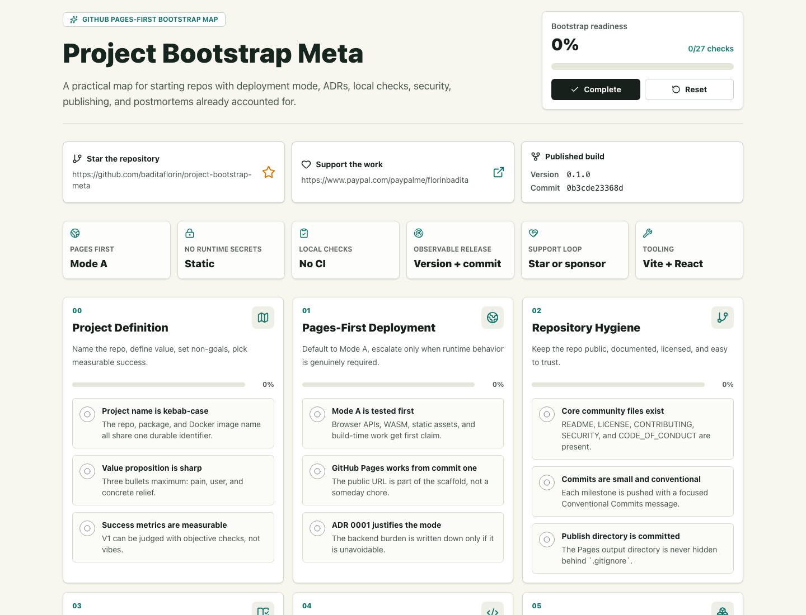
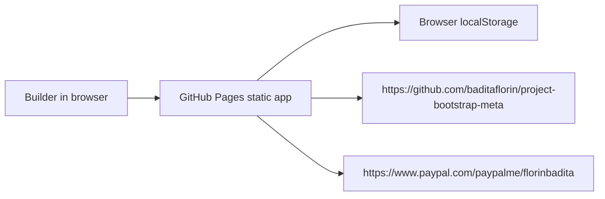

# Project Bootstrap Meta


Live site: https://baditaflorin.github.io/project-bootstrap-meta/

Repository: https://github.com/baditaflorin/project-bootstrap-meta

Support: https://www.paypal.com/paypalme/florinbadita

Project Bootstrap Meta is a GitHub Pages-first bootstrap map for disciplined project setup: deployment mode, ADRs, local checks, security posture, publishing conventions, and a completion postmortem in one static app.



## Quickstart

```bash
npm install
make install-hooks
make build
make pages-preview
make smoke
```

## What It Gives You

- A Mode A static app published from `main` branch `/docs`.
- A visible repository link so visitors can star it: https://github.com/baditaflorin/project-bootstrap-meta
- A visible PayPal support link: https://www.paypal.com/paypalme/florinbadita
- Version and source commit shown on the live page.
- ADRs, docs, tests, smoke checks, local hooks, and secret scanning without GitHub Actions.

## Architecture



Detailed architecture: docs/architecture.md

ADRs: docs/adr/

Deployment guide: docs/deploy.md

Privacy: docs/privacy.md

## Local Checks

```bash
make lint
make test
make test-integration
make build
make smoke
```

`make install-hooks` wires `.githooks/` through `core.hooksPath`.

## Status

This repository is intentionally Mode A: Pure GitHub Pages. There is no runtime backend, no Docker service, no nginx deployment, no GitHub Actions, and no server-side secret surface in v1.
