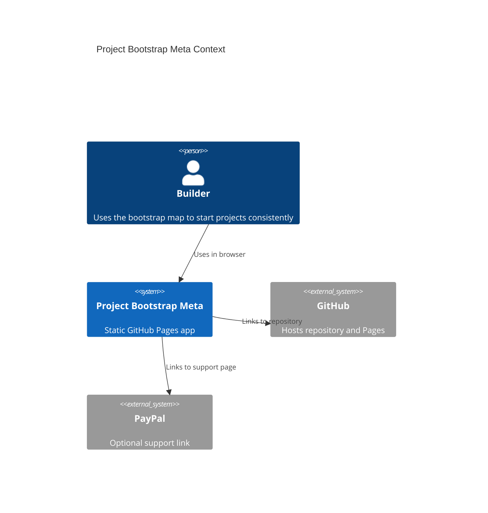
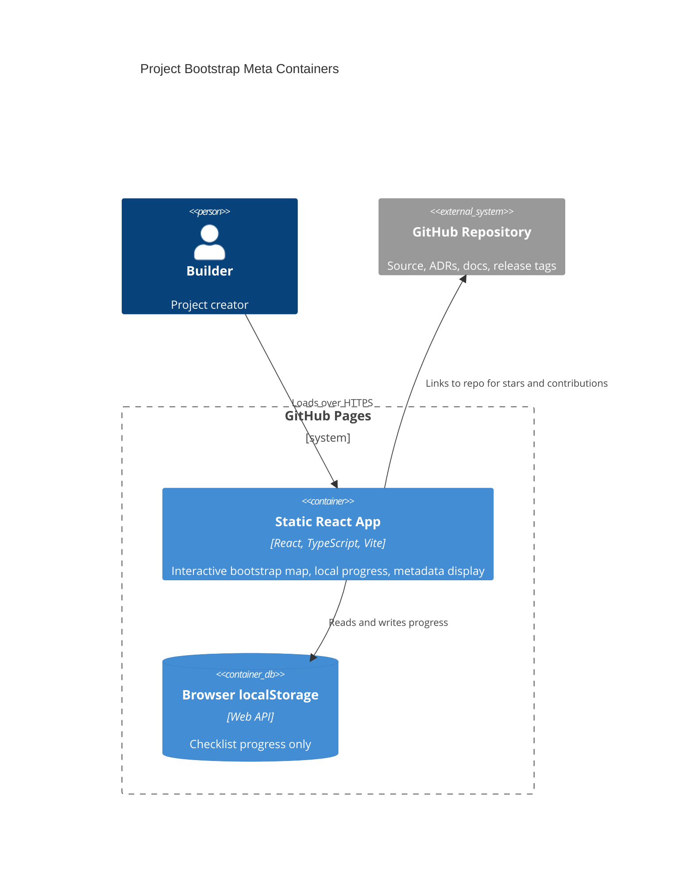

# Architecture

## Context

```mermaid
C4Context
  title Project Bootstrap Meta Context
  Person(builder, "Builder", "Uses the bootstrap map to start projects consistently")
  System(site, "Project Bootstrap Meta", "Static GitHub Pages app")
  System_Ext(github, "GitHub", "Hosts repository and Pages")
  System_Ext(paypal, "PayPal", "Optional support link")
  Rel(builder, site, "Uses in browser")
  Rel(site, github, "Links to repository")
  Rel(site, paypal, "Links to support page")
```

## Container

```mermaid
C4Container
  title Project Bootstrap Meta Containers
  Person(builder, "Builder", "Project creator")
  Boundary(pages, "GitHub Pages") {
    Container(app, "Static React App", "React, TypeScript, Vite", "Interactive bootstrap map, local progress, metadata display")
    ContainerDb(localStorage, "Browser localStorage", "Web API", "Checklist progress only")
  }
  System_Ext(repo, "GitHub Repository", "Source, ADRs, docs, release tags")
  Rel(builder, app, "Loads over HTTPS")
  Rel(app, localStorage, "Reads and writes progress")
  Rel(app, repo, "Links to repo for stars and contributions")
```

The GitHub Pages boundary is explicit: the app is built into `docs/` and served statically. There is no runtime backend in v1.
